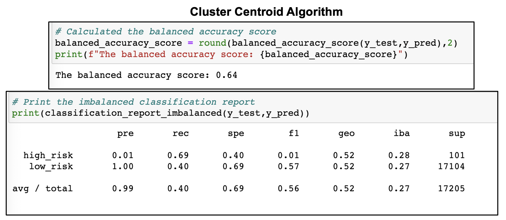

# Credit_Risk_Analysis

## Analyzing credit risk using Machine learning

## Overview of the analysis: 

Credit risk is an inherently unbalanced classification problem, as good loans easily outnumber risky loans. Therefore, it becomes necessary to employ different machine learning techniques to train and evaluate models with unbalanced classes. Using the credit card credit dataset from LendingClub, a peer-to-peer lending services company, I applied various sampling techniques to obtain same number of data points, like oversampling the data using the **RandomOverSampler** and **SMOTE** algorithms, and undersampling the data using the **ClusterCentroids** algorithm. This was followed by implementing a combinatorial approach of over and undersampling using the **SMOTEENN** algorithm. Next, two new machine learning models namely  **BalancedRandomForestClassifier** and **EasyEnsembleClassifier** were used to reduces bias and to predict the credit risk.

## Results: 

### Oversampling

Class imbalance is a situation in which the existing classes in a dataset aren't equally represented.One strategy to deal with imbalance is **oversampling**. If one class has too few instances in the training set, more instances from that class are chosen for training until it is large enough. The 2 oversampling algorithms that were applied are as follows:

#### Naive Random Over Sampler algorithm :

In Naive random oversampling, instances of the minority class are randomly selected and added to the training set until the majority and minority classes are balanced.

* The balanced accuracy score is 64%
* For high risk :
    1. The precision is 1% and sensitivity (recall) is 66% 
    2. The F1-score which is a harmonic mean of the model's precision and recall is 2%.
    
    
* For low risk:
    1. The precision is 100 % and sensitivity (recall) is 61% .
    2. The F1-score which is a harmonic mean of the model's precision and recall is 76%.
    
#### SMOTE algorithm :
In SMOTE, from an instance from the minority class, a number of its closest neighbors are chosen and based on the values of these neighbors, new values are created to balance the classes.

* The balanced accuracy score is 64 %
* For high risk :
    1. The precision is 1% and sensitivity (recall) is 62% .
    2. The F1-score which is a harmonic mean of the model's precision and recall is 2%.
    
* For low risk:
    1. The precision is 100 % and sensitivity (recall) is 69%.
    2. The F1-score which is a harmonic mean of the model's precision and recall is 82%.
    
### Undersampling
Undersampling is another technique to address class imbalance.In the undersampling algorithms the size of the majority class is decreased.The undersampling algorithm that was applied is as follows:

#### Cluster Centroid algorithm :
This algorithm identifies clusters of the majority class, then generates synthetic data points, called centroids, that are representative of the clusters. The majority class is then undersampled down to the size of the minority class.

* The balanced accuracy score is 64 %
* For high risk :
    1. The precision is 1% and sensitivity (recall) is 69% .
    2. The F1-score which is a harmonic mean of the model's precision and recall is 1%.
    
* For low risk:
    1. The precision is 100 % and sensitivity (recall) is 40% .
    2. The F1-score which is a harmonic mean of the model's precision and recall is 57%. 
   
### Combination of Over and Under sampling
SMOTEENN combines the SMOTE and Edited Nearest Neighbors (ENN) algorithms.First, Oversample the minority class with SMOTE, followed by cleaning the resulting data with an undersampling strategy. If the two nearest neighbors of a data point belong to two different classes, those data point are dropped.

#### SMOTEEN algorithm :

* The balanced accuracy score is 64 %
* For high risk :
    1. The precision is 1% and sensitivity (recall) is 72% .
    2. The F1-score which is a harmonic mean of the model's precision and recall is 2%.
    
* For low risk:
    1. The precision is 100 % and sensitivity (recall) is 57% .
    2. The F1-score which is a harmonic mean of the model's precision and recall is 73%.

### Ensemble Algorithms
The concept of ensemble algorithms is to combine multiple models to help improve the accuracy and robustness, as well as decrease variance of the model, and therefore increase the overall performance of the model. The ensemble algorithms that are applied are as follows:

#### Balanced Random Forest Classifier algorithm :

* The balanced accuracy score is 79 %
* For high risk :
    1. The precision is 3% and sensitivity (recall) is 70% .
    2. The F1-score which is a harmonic mean of the model's precision and recall is 6%.
    
* For low risk:
    1. The precision is 100 % and sensitivity (recall) is 87% .
    2..The F1-score which is a harmonic mean of the model's precision and recall is 93%. 
    
#### Easy Ensemble AdaBoost Classifier algorithm :

* The balanced accuracy score is 92 %
* For high risk :
    1. The precision is 5% and sensitivity (recall) is 93% .
    2. The F1-score which is a harmonic mean of the model's precision and recall is 10%.
    
* For low risk:
    1. The precision is 100 % and sensitivity (recall) is 90% .
    2. The F1-score which is a harmonic mean of the model's precision and recall is 95%.

## Summary: 
#### Naive Random Over Sampler algorithm :
* The precision for prediction of the high risk and the low risk loans are heavily skewed.The precision for low risk is 100% as compared to high risk which is 1%. 
* However, the recall (sensitivity) for high risk loan and low risk loan are in line with each other. The high risk is 66% and low risk is 61%.
* The lower precision for high risk loan is reflected in the dropped F1-score of 2%.
* The high precision and sensitivity of the low risk loans accounts for the high F1-score of 76%.
* This algorithm is not suitable in predicting credit risks.

#### SMOTE algorithm :
* The precision for prediction of the high risk and the low risk loans are heavily skewed.The precision for low risk is 100% as compared to high risk which is 1%. 
* However, the recall (sensitivity) for high risk loan and low risk loan are in line with each other. The high risk is 69% and low risk is 62%.
* The lower precision for high risk loan is reflected in the dropped F1-score of 2%.
* The high precision and sensitivity of the low risk loans accounts for the high F1-score of 82%.
* This algorithm is not suitable in predicting credit risks.

#### Cluster Centroid algorithm :
* The precision for prediction of the high risk and the low risk loans are heavily skewed.The precision for low risk is 100% as compared to high risk which is 1%. 
* However, the recall (sensitivity) for high risk loan is higher 69% compared to the low risk loans (40%).
* The lower precision for high risk loan is reflected in the dropped F1-score of 1%.
* The high precision and low sensitivity of the low risk loans accounts for the drop in F1-score to 56%.
* This algorithm is not suitable in predicting credit risks.

#### SMOTEEN algorithm :
* The precision for prediction of the high risk and the low risk loans are heavily skewed.The precision for low risk is 100% as compared to high risk which is 1%. 
* However, the recall (sensitivity) for high risk loan is higher 72% compared to the low risk loans (57%).
* The lower precision for high risk loan is reflected in the dropped F1-score of 2%.
* The high precision and moderate sensitivity of the low risk loans accounts for the high F1-score to 73%.
* This algorithm is not suitable in predicting credit risks.

#### Balanced Random Forest Classifier algorithm :
* The precision for prediction of the high risk and the low risk loans are heavily skewed.The precision for low risk is 100% as compared to high risk which is 3%. 
* However, the recall (sensitivity) for low risk loan is higher 87% compared to the high risk loans (70%).
* The lower precision for high sensitivity for high risk loan is reflected in the dropped F1-score of 6%.
* The high precision and very high sensitivity of the low risk loans accounts for the very high F1-score to 93%.

#### Ada Boost Classifier algorithm :
* The balanced accuracy score is very high at 92%.
* The precision for prediction of the high risk and the low risk loans are heavily skewed.The precision for low risk is 100% as compared to high risk which is 5%. 
* However, the recall (sensitivity) for high risk loan and low risk loan are in line with each other. The high risk is 93% and low risk is 90%.
* The lower precision for high sensitivity for high risk loan is reflected in increased F1-score of 10%.
* The high precision and very high sensitivity of the low risk loans accounts for the very high F1-score to 95%.

According to me, none of the above algorithms are suitable in detecting credit risks. The reasons are as follows:
* All the models have a very low precision score on detecting if the credit risk is high.
* The sensitivity for low risk is also not great, hence this might affect the Lending Club in the long run to survive in business.
* Comparatively, the ensemble models have a much higher sensitivity but with low precision meaning too many false positives in detecting the high risk loans.This again will hit the Lending Club in the long run.  
Based on all these reasons I would not recommend any of these algorithms to be applied for detecting credit risks for LendingClub.
